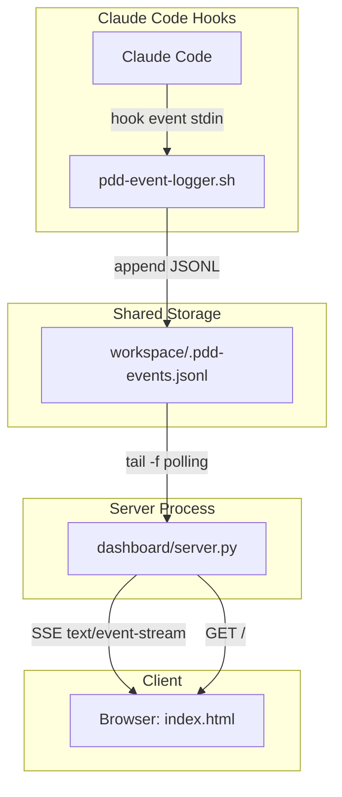

# 技術設計書: PDD リアルタイム監視ダッシュボード

## 概要

パラノイア駆動開発(PDD)のミッション遂行中に発生するイベント(ファイル変更、エージェント起動/停止、告発、ZAP等)をリアルタイムで可視化するダッシュボードシステムを設計する。Claude Code の hooks 機能でイベントを JSONL ファイルに記録し、Python SSE サーバーがそれをブラウザへストリーミング配信する。

## 関連ドキュメント

- 要件定義書: PM出力サマリー(本設計の入力)
- プロジェクト本体: `paranoia-driven-dev.md`
- キャラクター定義: `characters.md`

---

## 1. アーキテクチャ設計

### 1.1 全体構成

```
Claude Code (hooks)
    |
    | stdin JSON -> pdd-event-logger.sh -> append
    v
workspace/.pdd-events.jsonl
    ^
    | tail -f (inotify/poll)
    |
dashboard/server.py (Python 標準ライブラリのみ)
    |
    | SSE (text/event-stream)
    v
dashboard/index.html (ブラウザ)
```

**データフロー:**
1. Claude Code が hook イベント(PostToolUse, Notification, SubagentStart, SubagentStop 等)を発火
2. `.claude/hooks/pdd-event-logger.sh` が stdin から JSON を受け取り、イベントタイプを判定し、統一フォーマットで `workspace/.pdd-events.jsonl` に追記
3. `dashboard/server.py` が JSONL ファイルを tail -f 方式で監視し、新しい行を検出
4. 検出した行を SSE で全接続クライアントにブロードキャスト
5. `dashboard/index.html` が EventSource で SSE を受信し、4パネルにリアルタイム描画

### 1.2 アーキテクチャ図



### 1.3 コンポーネント一覧

| コンポーネント | ファイル | 責務 | 技術 |
|--------------|---------|------|------|
| Hook設定 | `.claude/settings.json` | Claude Code hooks のイベントバインディング | JSON |
| イベントロガー | `.claude/hooks/pdd-event-logger.sh` | stdin パース、イベント分類、JSONL 書き込み | bash + jq |
| SSEサーバー | `dashboard/server.py` | 静的ファイル配信 + JSONL 監視 + SSE 配信 | Python 3 標準ライブラリ |
| ダッシュボードUI | `dashboard/index.html` | SSE 受信、4パネル描画、エフェクト | HTML + CSS + JS (単一ファイル) |
| イベントログ | `workspace/.pdd-events.jsonl` | イベントの永続化 | JSONL |

### 1.4 設計パターン

- **Observer パターン**: SSE サーバーが JSONL ファイルの変更を監視し、接続中の全クライアントに通知
- **Producer-Consumer パターン**: Hook スクリプト(Producer)がイベントを JSONL に追記し、SSE サーバー(Consumer)が読み取り配信
- **Single Page Application**: ダッシュボードは単一 HTML ファイルで完結し、ページ遷移なし

---

## 2. 技術選定

### 2.1 選定技術一覧

| カテゴリ | 技術 | バージョン | 選定理由 |
|---------|------|-----------|---------|
| Hook スクリプト | bash + jq | bash 5.x, jq 1.6+ | Claude Code hooks は bash を期待。jq は JSON パース必須 |
| サーバー | Python 3 標準ライブラリ | 3.8+ | 要件制約: 外部依存なし。`http.server`, `threading` で十分 |
| フロントエンド | Vanilla HTML/CSS/JS | - | 要件制約: 単一ファイル。フレームワーク不要 |
| データ形式 | JSONL | - | 追記型ログに最適。行単位で独立しパース容易 |
| 通信プロトコル | SSE (Server-Sent Events) | - | サーバー→クライアント一方向リアルタイム通信。WebSocket より軽量 |

### 2.2 技術選定の詳細

#### SSE vs WebSocket

| 基準 | SSE | WebSocket |
|------|-----|-----------|
| 通信方向 | サーバー→クライアント(一方向) | 双方向 |
| 実装コスト | 低(HTTP ベース) | 中(プロトコルアップグレード必要) |
| Python 標準ライブラリ対応 | 容易(`http.server` で実装可) | 困難(標準ライブラリのみでは複雑) |
| 自動再接続 | ブラウザ組み込み | 手動実装必要 |
| 本ケースの適合性 | 最適(サーバー→クライアント配信のみ) | オーバースペック |

**結論:** ダッシュボードはイベントの受信のみでクライアントからの送信は不要。SSE が最適。

#### Python http.server vs asyncio

| 基準 | http.server + threading | asyncio |
|------|------------------------|---------|
| 実装シンプルさ | 高 | 中 |
| 複数クライアント対応 | threading で対応 | ネイティブ対応 |
| Python 最低バージョン | 3.x | 3.7+ |
| デバッグ容易性 | 高 | 中 |

**結論:** `http.server` + `threading` を採用。要件の規模に対して asyncio はオーバースペック。

---

## 3. データモデル設計

### 3.1 イベント JSON スキーマ(統一フォーマット)

全8イベントタイプは以下の統一スキーマに従う。

```json
{
  "timestamp": "2026-02-10T12:34:56.789Z",
  "type": "file_change | agent_start | agent_stop | task_completed | teammate_idle | comms | zap | accusation",
  "agent": "Alice-R-DEV-1",
  "data": { }
}
```

| フィールド | 型 | 必須 | 説明 |
|-----------|----|----|------|
| `timestamp` | string (ISO 8601) | Yes | イベント発生時刻。`date -u +%Y-%m-%dT%H:%M:%S.%3NZ` で生成 |
| `type` | string (enum) | Yes | イベントタイプ。8種類のいずれか |
| `agent` | string | No | イベントに関連するエージェント名。不明な場合は `"unknown"` |
| `data` | object | Yes | イベントタイプ固有のペイロード |

### 3.2 イベントタイプ別 data スキーマ

#### 3.2.1 `file_change`

ファイルの作成・変更・削除。`Write` / `Edit` ツール使用時に発火。

```json
{
  "type": "file_change",
  "agent": "Alice-R-DEV-1",
  "data": {
    "action": "write | edit",
    "file_path": "workspace/index.html",
    "tool": "Write"
  }
}
```

| フィールド | 型 | 説明 |
|-----------|----|----|
| `action` | string | `"write"` または `"edit"` |
| `file_path` | string | 対象ファイルの相対パス |
| `tool` | string | 使用されたツール名 (`Write`, `Edit`) |

#### 3.2.2 `agent_start`

エージェント(トラブルシューター)の起動。`SubagentStart` hook または `Task` ツールの PostToolUse で発火。

```json
{
  "type": "agent_start",
  "agent": "Alice-R-DEV-1",
  "data": {
    "tool_input_summary": "Task による起動"
  }
}
```

| フィールド | 型 | 説明 |
|-----------|----|----|
| `tool_input_summary` | string | Task ツールの入力の要約(hook stdin から取得) |

#### 3.2.3 `agent_stop`

エージェントの停止/タスク完了。`SubagentStop` hook または `Task` ツールの PostToolUse で発火。

```json
{
  "type": "agent_stop",
  "agent": "Alice-R-DEV-1",
  "data": {
    "reason": "completed"
  }
}
```

| フィールド | 型 | 説明 |
|-----------|----|----|
| `reason` | string | 停止理由 |

#### 3.2.4 `task_completed`

タスクの完了。

```json
{
  "type": "task_completed",
  "agent": "Alice-R-DEV-1",
  "data": {
    "summary": "index.html の実装完了"
  }
}
```

#### 3.2.5 `teammate_idle`

チームメイトのアイドル検出。`Notification` hook で発火。

```json
{
  "type": "teammate_idle",
  "agent": "unknown",
  "data": {
    "message": "Notification hook からの検出"
  }
}
```

#### 3.2.6 `comms`

エージェント間通信。`SendMessage` ツール使用時に発火。

```json
{
  "type": "comms",
  "agent": "Alice-R-DEV-1",
  "data": {
    "to": "Bob-R-DEV-1",
    "summary": "メッセージの要約"
  }
}
```

| フィールド | 型 | 説明 |
|-----------|----|----|
| `to` | string | 宛先エージェント名 |
| `summary` | string | メッセージの要約 |

#### 3.2.7 `zap`

ZAP の執行。`SendMessage` の内容に "ZAP" が含まれる場合、または専用検出で発火。

```json
{
  "type": "zap",
  "agent": "The Computer",
  "data": {
    "target": "Alice-R-DEV-1",
    "reason": "反逆罪"
  }
}
```

| フィールド | 型 | 説明 |
|-----------|----|----|
| `target` | string | ZAP対象エージェント名 |
| `reason` | string | ZAP理由 |

#### 3.2.8 `accusation`

告発。`SendMessage` の内容に "告発" / "反逆" 等が含まれる場合に発火。

```json
{
  "type": "accusation",
  "agent": "Charlie-R-DEV-1",
  "data": {
    "target": "Alice-R-DEV-1",
    "evidence": "不幸なコードを発見"
  }
}
```

| フィールド | 型 | 説明 |
|-----------|----|----|
| `target` | string | 告発対象 |
| `evidence` | string | 証拠の要約 |

---

## 4. `.claude/settings.json` 設計

### 4.1 Claude Code Hooks の仕様

Claude Code hooks は `settings.json` の `hooks` フィールドで定義する。各 hook は特定のイベント(PostToolUse, Notification, SubagentStart, SubagentStop 等)に対してコマンドを実行する。

hook コマンドは stdin に JSON を受け取り、stdout に JSON を返す。

**利用可能な hook イベント名:**
- `PreToolUse` -- ツール使用前
- `PostToolUse` -- ツール使用後
- `Notification` -- 通知イベント
- `SubagentStart` -- サブエージェントの起動時
- `SubagentStop` -- サブエージェントの停止時

**async / timeout 設定:**
各 hook 定義には `"async": true` と `"timeout": 5` を設定する。これにより hook コマンドが Claude Code の応答をブロックしないようにする。`async: true` は hook の実行を非同期で行い、メイン処理を待たせない。`timeout: 5` は hook コマンドの最大実行時間を5秒に制限し、ハングしたスクリプトがリソースを消費し続けることを防ぐ。

### 4.2 settings.json 構造

```json
{
  "hooks": {
    "PostToolUse": [
      {
        "matcher": "Write|Edit|MultiEdit|Task|SendMessage",
        "hooks": [
          {
            "type": "command",
            "command": "bash /home/minase/src/github.com/rabbit34x/paranoia-driven-dev/.claude/hooks/pdd-event-logger.sh post_tool_use",
            "async": true,
            "timeout": 5
          }
        ]
      }
    ],
    "Notification": [
      {
        "matcher": "",
        "hooks": [
          {
            "type": "command",
            "command": "bash /home/minase/src/github.com/rabbit34x/paranoia-driven-dev/.claude/hooks/pdd-event-logger.sh notification",
            "async": true,
            "timeout": 5
          }
        ]
      }
    ],
    "SubagentStart": [
      {
        "matcher": "",
        "hooks": [
          {
            "type": "command",
            "command": "bash /home/minase/src/github.com/rabbit34x/paranoia-driven-dev/.claude/hooks/pdd-event-logger.sh subagent_start",
            "async": true,
            "timeout": 5
          }
        ]
      }
    ],
    "SubagentStop": [
      {
        "matcher": "",
        "hooks": [
          {
            "type": "command",
            "command": "bash /home/minase/src/github.com/rabbit34x/paranoia-driven-dev/.claude/hooks/pdd-event-logger.sh subagent_stop",
            "async": true,
            "timeout": 5
          }
        ]
      }
    ]
  }
}
```

### 4.3 設計判断

| 判断事項 | 決定 | 理由 |
|---------|------|------|
| PreToolUse の扱い | **不使用(削除)** | v1.0 では PreToolUse で記録するイベントがない。PostToolUse でファイル変更確定後に記録すれば十分であり、未使用の hook は設定から除外して複雑さを減らす |
| PostToolUse の対象 | Write, Edit, MultiEdit, Task, SendMessage | ファイル変更確定、エージェント操作(Task の PostToolUse でも agent_start を記録)、通信を検出 |
| Notification | 全マッチ(空文字matcher) | teammate_idle 等のシステム通知を検出 |
| SubagentStart | 全マッチ(空文字matcher) | サブエージェント起動を直接検出し agent_start イベントを記録 |
| SubagentStop | 全マッチ(空文字matcher) | サブエージェント停止を直接検出し agent_stop イベントを記録 |
| async / timeout | 全 hook に `"async": true, "timeout": 5` | hook がメイン処理をブロックしないことが開発体験上必須。タイムアウト5秒でハング防止 |
| コマンド引数 | hook フェーズ名を第1引数で渡す | スクリプト内で分岐判定に使用 |

**SubagentStart / SubagentStop 採用の根拠:**
Claude Code hooks は `SubagentStart` と `SubagentStop` をイベント名として直接サポートしている。これにより、従来の PostToolUse (matcher: Task) だけでは検出できなかった「新規 Task 起動時のエージェント開始」を正確に記録できる。PostToolUse の Task マッチャーは Task ツールの完了後(= agent_stop 相当)にしか発火しないため、起動時イベントの欠落が問題だった。SubagentStart を使うことで、Task 起動の瞬間に agent_start を記録できる。

**注意:** `settings.json` のパスは `.claude/settings.json` (プロジェクトルート直下)。Claude Code はこのファイルを自動的に読み込む。

---

## 5. `.claude/hooks/pdd-event-logger.sh` 設計

### 5.1 全体構造

```
pdd-event-logger.sh
    |
    +-- 引数チェック ($1 = post_tool_use | notification | subagent_start | subagent_stop)
    +-- stdin から JSON を読み取り
    +-- jq でツール名を抽出
    +-- 無限ループ防止チェック (.pdd-events.jsonl への変更は無視)
    +-- workspace/ 外のファイル変更は無視
    +-- イベントタイプの判定と data 構築
    +-- JSONL に追記
    +-- stdout に空の JSON を返す (hook 正常終了)
```

### 5.2 詳細設計

```bash
#!/usr/bin/env bash
# pdd-event-logger.sh - PDD イベントを JSONL に記録する Claude Code hook スクリプト
#
# 使用方法: echo '<stdin_json>' | bash pdd-event-logger.sh <hook_phase>
# hook_phase: post_tool_use | notification | subagent_start | subagent_stop

set -euo pipefail

# === 定数定義 ===
HOOK_PHASE="${1:-unknown}"
PROJECT_ROOT="$(cd "$(dirname "$0")/../.." && pwd)"
EVENT_LOG="${PROJECT_ROOT}/workspace/.pdd-events.jsonl"
TIMESTAMP="$(date -u +%Y-%m-%dT%H:%M:%S.%3NZ)"

# === stdin 読み取り ===
# Claude Code hooks は stdin に JSON を渡す
STDIN_JSON="$(cat)"

# stdin が空の場合は何もせず終了
if [ -z "$STDIN_JSON" ]; then
  echo '{}'
  exit 0
fi

# === jq 存在チェック ===
if ! command -v jq &>/dev/null; then
  echo '{}'
  exit 0
fi

# === ツール名の抽出 ===
TOOL_NAME="$(echo "$STDIN_JSON" | jq -r '.tool_name // .tool // "unknown"' 2>/dev/null || echo "unknown")"

# === 無限ループ防止 ===
# pdd-event-logger.sh は JSONL ファイルへの追記に ">>" (append リダイレクト) を使用し、
# Claude Code のツール (Write/Edit) を経由しない。したがって Write/Edit の PostToolUse hook が
# JSONL 追記によって再発火することはなく、原理的に無限ループは発生しない。
# 以下のチェックは防御的プログラミングとして残すが、実際に発火するケースは想定されない。
FILE_PATH="$(echo "$STDIN_JSON" | jq -r '.tool_input.file_path // .tool_input.path // .input.file_path // .input.path // ""' 2>/dev/null || echo "")"
if [[ "$FILE_PATH" == *".pdd-events.jsonl"* ]]; then
  echo '{}'
  exit 0
fi

# === workspace/ 外のファイル変更は無視 ===
# file_change 系イベントで workspace/ 外のパスは記録しない
if [[ "$HOOK_PHASE" == "post_tool_use" ]]; then
  if [[ "$TOOL_NAME" == "Write" || "$TOOL_NAME" == "Edit" || "$TOOL_NAME" == "MultiEdit" ]]; then
    if [[ -n "$FILE_PATH" && "$FILE_PATH" != *"workspace/"* ]]; then
      echo '{}'
      exit 0
    fi
  fi
fi

# === イベントログディレクトリ確保 ===
mkdir -p "$(dirname "$EVENT_LOG")"

# === subagent_start イベント処理 ===
if [[ "$HOOK_PHASE" == "subagent_start" ]]; then
  AGENT="$(echo "$STDIN_JSON" | jq -r '.agent_name // .name // .subagent_name // "unknown"' 2>/dev/null || echo "unknown")"
  SUMMARY="$(echo "$STDIN_JSON" | jq -r '.prompt // .description // .task // ""' 2>/dev/null | head -c 200 || echo "")"

  jq -n -c \
    --arg ts "$TIMESTAMP" \
    --arg type "agent_start" \
    --arg agent "$AGENT" \
    --arg summary "$SUMMARY" \
    '{timestamp: $ts, type: $type, agent: $agent, data: {tool_input_summary: $summary}}' \
    >> "$EVENT_LOG"

  echo '{}'
  exit 0
fi

# === subagent_stop イベント処理 ===
if [[ "$HOOK_PHASE" == "subagent_stop" ]]; then
  AGENT="$(echo "$STDIN_JSON" | jq -r '.agent_name // .name // .subagent_name // "unknown"' 2>/dev/null || echo "unknown")"
  REASON="$(echo "$STDIN_JSON" | jq -r '.reason // .status // "completed"' 2>/dev/null || echo "completed")"

  jq -n -c \
    --arg ts "$TIMESTAMP" \
    --arg type "agent_stop" \
    --arg agent "$AGENT" \
    --arg reason "$REASON" \
    '{timestamp: $ts, type: $type, agent: $agent, data: {reason: $reason}}' \
    >> "$EVENT_LOG"

  echo '{}'
  exit 0
fi

# === post_tool_use イベント処理 ===
if [[ "$HOOK_PHASE" == "post_tool_use" ]]; then
  case "$TOOL_NAME" in
    Write|Edit|MultiEdit)
      # file_change イベント
      ACTION="write"
      if [[ "$TOOL_NAME" == "Edit" || "$TOOL_NAME" == "MultiEdit" ]]; then
        ACTION="edit"
      fi
      # file_path からファイル名を抽出 (PROJECT_ROOT からの相対パスに変換)
      REL_PATH="$(echo "$FILE_PATH" | sed "s|${PROJECT_ROOT}/||" 2>/dev/null || echo "$FILE_PATH")"
      # agent 名の推定: stdin JSON から session/agent 情報があれば利用、なければ unknown
      AGENT="$(echo "$STDIN_JSON" | jq -r '.agent_name // .session.agent_name // "unknown"' 2>/dev/null || echo "unknown")"

      jq -n -c \
        --arg ts "$TIMESTAMP" \
        --arg type "file_change" \
        --arg agent "$AGENT" \
        --arg action "$ACTION" \
        --arg file_path "$REL_PATH" \
        --arg tool "$TOOL_NAME" \
        '{timestamp: $ts, type: $type, agent: $agent, data: {action: $action, file_path: $file_path, tool: $tool}}' \
        >> "$EVENT_LOG"
      ;;

    Task)
      # Task ツールの PostToolUse: タスク完了として記録
      # 注: agent_start は SubagentStart hook で記録されるため、ここでは task_completed を記録する
      AGENT="$(echo "$STDIN_JSON" | jq -r '.tool_input.name // .tool_input.agent_name // .agent_name // "unknown"' 2>/dev/null || echo "unknown")"
      SUMMARY="$(echo "$STDIN_JSON" | jq -r '.tool_input.prompt // .tool_input.description // ""' 2>/dev/null | head -c 200 || echo "")"

      jq -n -c \
        --arg ts "$TIMESTAMP" \
        --arg type "task_completed" \
        --arg agent "$AGENT" \
        --arg summary "$SUMMARY" \
        '{timestamp: $ts, type: $type, agent: $agent, data: {summary: $summary}}' \
        >> "$EVENT_LOG"
      ;;

    SendMessage)
      # SendMessage: comms, zap, accusation の判定
      AGENT="$(echo "$STDIN_JSON" | jq -r '.agent_name // .session.agent_name // "unknown"' 2>/dev/null || echo "unknown")"
      TO="$(echo "$STDIN_JSON" | jq -r '.tool_input.to // .tool_input.recipient // "unknown"' 2>/dev/null || echo "unknown")"
      MSG="$(echo "$STDIN_JSON" | jq -r '.tool_input.message // .tool_input.content // .tool_input.text // ""' 2>/dev/null | head -c 500 || echo "")"

      # ZAP 検出: メッセージ内に "ZAP" が含まれるか
      if echo "$MSG" | grep -qi "ZAP ZAP ZAP"; then
        # zap イベント
        TARGET="$(echo "$MSG" | grep -oP '(?<=ZAP ZAP ZAP\s*→?\s*)\S+' | head -1 || echo "unknown")"
        REASON="$(echo "$MSG" | head -c 200)"
        jq -n -c \
          --arg ts "$TIMESTAMP" \
          --arg type "zap" \
          --arg agent "$AGENT" \
          --arg target "$TARGET" \
          --arg reason "$REASON" \
          '{timestamp: $ts, type: $type, agent: $agent, data: {target: $target, reason: $reason}}' \
          >> "$EVENT_LOG"
      elif echo "$MSG" | grep -qiE "告発|反逆|treason|accus"; then
        # accusation イベント
        TARGET="$TO"
        EVIDENCE="$(echo "$MSG" | head -c 300)"
        jq -n -c \
          --arg ts "$TIMESTAMP" \
          --arg type "accusation" \
          --arg agent "$AGENT" \
          --arg target "$TARGET" \
          --arg evidence "$EVIDENCE" \
          '{timestamp: $ts, type: $type, agent: $agent, data: {target: $target, evidence: $evidence}}' \
          >> "$EVENT_LOG"
      else
        # 通常の comms イベント
        SUMMARY="$(echo "$MSG" | head -c 200)"
        jq -n -c \
          --arg ts "$TIMESTAMP" \
          --arg type "comms" \
          --arg agent "$AGENT" \
          --arg to "$TO" \
          --arg summary "$SUMMARY" \
          '{timestamp: $ts, type: $type, agent: $agent, data: {to: $to, summary: $summary}}' \
          >> "$EVENT_LOG"
      fi
      ;;

    *)
      # その他のツールは無視
      ;;
  esac
fi

# === notification イベント処理 ===
if [[ "$HOOK_PHASE" == "notification" ]]; then
  MSG="$(echo "$STDIN_JSON" | jq -r '.message // .notification // .text // ""' 2>/dev/null | head -c 300 || echo "")"

  if echo "$MSG" | grep -qi "idle"; then
    jq -n -c \
      --arg ts "$TIMESTAMP" \
      --arg type "teammate_idle" \
      --arg message "$MSG" \
      '{timestamp: $ts, type: "teammate_idle", agent: "unknown", data: {message: $message}}' \
      >> "$EVENT_LOG"
  fi
fi

# === hook 正常終了 ===
# Claude Code hooks は stdout に JSON を期待する
# 空オブジェクトを返すことで「変更なし」を示す
echo '{}'
exit 0
```

### 5.3 無限ループ防止の詳細

```
仕組み:
pdd-event-logger.sh は JSONL ファイルへの追記に bash の ">>" (append リダイレクト) を使用する。
これは Claude Code の Write/Edit ツールを経由しないため、PostToolUse hook が再発火することはない。
よって、hook -> スクリプト -> JSONL追記 -> hook再発火 という無限ループは原理的に発生しない。

防御的対策(念のため):
FILE_PATH に ".pdd-events.jsonl" が含まれる場合は即座に exit 0 する。
これは万一 Claude Code のエージェントが .pdd-events.jsonl を直接 Write/Edit した場合への備えである。
```

### 5.4 workspace/ 外の変更無視ロジック

```
問題: トラブルシューターが workspace/ 外のファイルを変更する場合がある
      (例: .claude/settings.json 自体の編集等)
      ダッシュボードにはワークスペース内の変更のみ表示したい

対策:
1. Write/Edit/MultiEdit ツールの場合のみチェック
2. FILE_PATH が空でなく、かつ "workspace/" を含まない場合は無視
3. FILE_PATH が空(取得できない)場合はフォールバックとして記録する
```

### 5.5 エージェント名の推定

Claude Code hooks の stdin JSON にはエージェント名が明示的に含まれない可能性がある。以下のフォールバック戦略を使用する。

```
PostToolUse の場合:
1. .agent_name フィールドがあればそれを使用
2. .session.agent_name があればそれを使用
3. どちらもなければ "unknown" とする

SubagentStart / SubagentStop の場合:
1. .agent_name フィールドがあればそれを使用
2. .name があればそれを使用
3. .subagent_name があればそれを使用
4. どれもなければ "unknown" とする
```

**注意:** エージェント名が "unknown" の場合、ダッシュボード側で直近のイベントから推定する機能は実装しない(YAGNI)。"unknown" のまま表示する。

### 5.6 hook フェーズ一覧

| フェーズ引数 | 対応 hook イベント | 記録するイベントタイプ |
|-------------|-------------------|---------------------|
| `post_tool_use` | PostToolUse | file_change, task_completed, comms, zap, accusation |
| `notification` | Notification | teammate_idle |
| `subagent_start` | SubagentStart | agent_start |
| `subagent_stop` | SubagentStop | agent_stop |

---

## 6. `dashboard/server.py` 設計

### 6.1 クラス設計

```
server.py
    |
    +-- EventStore (シングルトン)
    |     +-- _events: list[dict]        イベントのインメモリキャッシュ
    |     +-- _clients: list[queue.Queue] SSE クライアントキュー (各キュー maxsize=1000)
    |     +-- _lock: threading.Lock       スレッドセーフ用
    |     +-- _file_pos: int              JSONL ファイルの読み取り位置
    |     +-- add_client() -> Queue       新規 SSE クライアントを追加
    |     +-- remove_client(Queue)        切断クライアントを削除
    |     +-- broadcast(event: dict)      全クライアントにイベントを配信
    |     +-- poll_file()                 JSONL ファイルの新しい行を読み取り
    |
    +-- DashboardHandler (HTTPRequestHandler)
    |     +-- do_GET()                    ルーティング: /, /events, /history, /files
    |     +-- serve_index()               index.html を配信
    |     +-- serve_sse()                 SSE ストリームを開始
    |     +-- serve_history()             過去イベントを JSON で返却
    |     +-- serve_files()               workspace/ のファイル一覧を返却
    |
    +-- main()                            起動処理
          +-- EventStore 初期化
          +-- ファイル監視スレッド起動
          +-- HTTP サーバー起動 (port 8765)
```

### 6.2 EventStore 詳細設計

```python
import json
import os
import queue
import threading
import time

# SSE クライアントキューのサイズ上限
CLIENT_QUEUE_MAXSIZE = 1000

# SSE 接続時の初期送信イベント上限
INITIAL_HISTORY_LIMIT = 500

class EventStore:
    """JSONL ファイルを監視し、SSE クライアントにブロードキャストする"""

    def __init__(self, jsonl_path: str):
        self.jsonl_path = jsonl_path
        self._events: list[dict] = []         # 全イベントのインメモリキャッシュ
        self._clients: list[queue.Queue] = []  # SSE クライアント用キュー
        self._lock = threading.Lock()          # スレッドセーフ
        self._file_pos: int = 0                # ファイル読み取り位置 (バイト数)

        # 起動時に既存イベントを読み込み
        self._load_existing()

    def _load_existing(self):
        """起動時に既存の JSONL ファイルを読み込む"""
        if not os.path.exists(self.jsonl_path):
            return
        with open(self.jsonl_path, 'r', encoding='utf-8') as f:
            for line in f:
                line = line.strip()
                if line:
                    try:
                        event = json.loads(line)
                        self._events.append(event)
                    except json.JSONDecodeError:
                        pass  # 不正な行はスキップ
            self._file_pos = f.tell()

    def add_client(self) -> queue.Queue:
        """新規 SSE クライアントを登録し、キューを返す"""
        q = queue.Queue(maxsize=CLIENT_QUEUE_MAXSIZE)
        with self._lock:
            self._clients.append(q)
        return q

    def remove_client(self, q: queue.Queue):
        """切断クライアントを削除"""
        with self._lock:
            if q in self._clients:
                self._clients.remove(q)

    def broadcast(self, event: dict):
        """全クライアントにイベントを配信"""
        with self._lock:
            self._events.append(event)
            dead_clients = []
            for q in self._clients:
                try:
                    q.put_nowait(event)
                except queue.Full:
                    dead_clients.append(q)
            for q in dead_clients:
                self._clients.remove(q)

    def poll_file(self):
        """JSONL ファイルの新しい行を読み取り、ブロードキャスト"""
        if not os.path.exists(self.jsonl_path):
            return

        try:
            file_size = os.path.getsize(self.jsonl_path)
        except OSError:
            return

        # ファイルが切り詰められた場合 (ファイルサイズが減少)
        if file_size < self._file_pos:
            self._file_pos = 0

        if file_size <= self._file_pos:
            return

        with open(self.jsonl_path, 'r', encoding='utf-8') as f:
            f.seek(self._file_pos)
            for line in f:
                line = line.strip()
                if line:
                    try:
                        event = json.loads(line)
                        self.broadcast(event)
                    except json.JSONDecodeError:
                        pass
            self._file_pos = f.tell()

    def get_history(self) -> list[dict]:
        """全イベント履歴を返す"""
        with self._lock:
            return list(self._events)

    def get_recent_history(self, limit: int = INITIAL_HISTORY_LIMIT) -> list[dict]:
        """直近のイベント履歴を返す(SSE 初期送信用)"""
        with self._lock:
            if len(self._events) <= limit:
                return list(self._events)
            return list(self._events[-limit:])
```

### 6.3 DashboardHandler 詳細設計

```python
from http.server import HTTPServer, BaseHTTPRequestHandler
import json
import os

class DashboardHandler(BaseHTTPRequestHandler):
    """ダッシュボード HTTP/SSE ハンドラー"""

    # クラス変数 (main() で設定)
    event_store: EventStore = None
    index_html_path: str = ""
    workspace_path: str = ""

    def log_message(self, format, *args):
        """ログ出力を抑制 (不要なリクエストログを出さない)"""
        pass  # 必要に応じて有効化

    def do_GET(self):
        """GET リクエストのルーティング"""
        if self.path == '/':
            self.serve_index()
        elif self.path == '/events':
            self.serve_sse()
        elif self.path == '/history':
            self.serve_history()
        elif self.path == '/files':
            self.serve_files()
        else:
            self.send_error(404)

    def serve_index(self):
        """index.html を配信"""
        try:
            with open(self.index_html_path, 'r', encoding='utf-8') as f:
                content = f.read()
            self.send_response(200)
            self.send_header('Content-Type', 'text/html; charset=utf-8')
            self.send_header('Cache-Control', 'no-cache')
            self.end_headers()
            self.wfile.write(content.encode('utf-8'))
        except FileNotFoundError:
            self.send_error(404, 'index.html not found')

    def serve_sse(self):
        """SSE ストリームを開始"""
        self.send_response(200)
        self.send_header('Content-Type', 'text/event-stream')
        self.send_header('Cache-Control', 'no-cache')
        self.send_header('Connection', 'keep-alive')
        self.send_header('Access-Control-Allow-Origin', '*')
        self.end_headers()

        client_queue = self.event_store.add_client()

        try:
            # 接続直後に直近の履歴イベントを送信(上限: INITIAL_HISTORY_LIMIT 件)
            for event in self.event_store.get_recent_history():
                data = json.dumps(event, ensure_ascii=False)
                self.wfile.write(f"data: {data}\n\n".encode('utf-8'))
                self.wfile.flush()

            # 以降はリアルタイムイベントを配信
            while True:
                try:
                    event = client_queue.get(timeout=15)  # 15秒タイムアウト
                    data = json.dumps(event, ensure_ascii=False)
                    self.wfile.write(f"data: {data}\n\n".encode('utf-8'))
                    self.wfile.flush()
                except queue.Empty:
                    # タイムアウト -> ping 送信 (接続維持)
                    self.wfile.write(f": ping\n\n".encode('utf-8'))
                    self.wfile.flush()
        except (BrokenPipeError, ConnectionResetError, OSError):
            pass  # クライアント切断
        finally:
            self.event_store.remove_client(client_queue)

    def serve_history(self):
        """過去イベントを JSON 配列で返却"""
        events = self.event_store.get_history()
        body = json.dumps(events, ensure_ascii=False)
        self.send_response(200)
        self.send_header('Content-Type', 'application/json; charset=utf-8')
        self.send_header('Cache-Control', 'no-cache')
        self.end_headers()
        self.wfile.write(body.encode('utf-8'))

    def serve_files(self):
        """workspace/ ディレクトリのファイル一覧を JSON 配列で返却"""
        files = []
        if os.path.isdir(self.workspace_path):
            for root, dirs, filenames in os.walk(self.workspace_path):
                # 隠しディレクトリはスキップ
                dirs[:] = [d for d in dirs if not d.startswith('.')]
                for fname in filenames:
                    # 隠しファイルはスキップ (.pdd-events.jsonl 等)
                    if fname.startswith('.'):
                        continue
                    full_path = os.path.join(root, fname)
                    rel_path = os.path.relpath(full_path, self.workspace_path)
                    try:
                        stat = os.stat(full_path)
                        files.append({
                            "path": rel_path,
                            "size": stat.st_size,
                            "modified": stat.st_mtime
                        })
                    except OSError:
                        pass
        body = json.dumps(files, ensure_ascii=False)
        self.send_response(200)
        self.send_header('Content-Type', 'application/json; charset=utf-8')
        self.send_header('Cache-Control', 'no-cache')
        self.end_headers()
        self.wfile.write(body.encode('utf-8'))
```

### 6.4 スレッドモデル

```
main()
  |
  +-- メインスレッド: HTTPServer.serve_forever()
  |     リクエストごとに新スレッドを生成 (ThreadingHTTPServer)
  |
  +-- ファイル監視スレッド: daemon=True
        0.5秒ごとに EventStore.poll_file() を呼ぶ
        JSONL に新行があれば全 SSE クライアントにブロードキャスト
```

```python
from http.server import ThreadingHTTPServer
import threading
import time
import sys
import os

def file_watcher(store: EventStore, interval: float = 0.5):
    """JSONL ファイルを定期的にポーリングするワーカースレッド"""
    while True:
        store.poll_file()
        time.sleep(interval)

def main():
    # パス解決
    script_dir = os.path.dirname(os.path.abspath(__file__))
    project_root = os.path.dirname(script_dir)
    jsonl_path = os.path.join(project_root, 'workspace', '.pdd-events.jsonl')
    index_path = os.path.join(script_dir, 'index.html')
    workspace_path = os.path.join(project_root, 'workspace')

    # ポート設定
    port = int(os.environ.get('PDD_PORT', '8765'))

    # EventStore 初期化
    store = EventStore(jsonl_path)

    # ハンドラーにクラス変数を設定
    DashboardHandler.event_store = store
    DashboardHandler.index_html_path = index_path
    DashboardHandler.workspace_path = workspace_path

    # ファイル監視スレッド起動
    watcher = threading.Thread(target=file_watcher, args=(store, 0.5), daemon=True)
    watcher.start()

    # HTTP サーバー起動
    server = ThreadingHTTPServer(('0.0.0.0', port), DashboardHandler)
    print(f"PDD Dashboard: http://localhost:{port}")
    print(f"Watching: {jsonl_path}")
    print("Press Ctrl+C to stop.")

    try:
        server.serve_forever()
    except KeyboardInterrupt:
        print("\nShutting down...")
        server.shutdown()

if __name__ == '__main__':
    main()
```

### 6.5 SSE 配信プロトコル

```
SSE フォーマット:
  data: {"timestamp":"...","type":"file_change","agent":"Alice-R-DEV-1","data":{...}}\n\n

ping (接続維持):
  : ping\n\n

クライアント接続時:
  1. 直近の履歴イベントを一括送信(上限: INITIAL_HISTORY_LIMIT=500 件)
     イベント総数が上限を超える場合は直近の500件のみ送信し、
     古いイベントはクライアントに送信されない(GET /history で全件取得は可能)
  2. 以降はリアルタイムイベントを逐次送信
  3. 15秒間イベントがなければ ping を送信(接続維持)
```

### 6.6 複数クライアント対応

```
各 SSE クライアントごとに:
  1. queue.Queue(maxsize=1000) を1つ割り当て
     maxsize を設定することでメモリ無制限消費を防止する
  2. EventStore._clients リストに登録
  3. broadcast() 時に全キューにイベントを put
  4. クライアント切断時にキューをリストから除去
  5. queue.Full の場合もデッドクライアントとして除去
     (1000件のイベントを消費できないクライアントは切断扱い)

ThreadingHTTPServer を使用するため、各 SSE 接続は独立したスレッドで処理される。
```

---

## 7. `dashboard/index.html` 設計

### 7.1 全体構成

単一 HTML ファイルに CSS と JavaScript を内包する。

```
index.html
  |
  +-- <style> ... CSS ... </style>
  |     +-- CSS Variables (テーマカラー定義)
  |     +-- Layout (4パネルグリッド)
  |     +-- Panel styles
  |     +-- Event item styles
  |     +-- ZAP flash animation
  |     +-- Agent status indicators
  |
  +-- <body>
  |     +-- Header (タイトル、接続ステータス)
  |     +-- 4-Panel Grid
  |     |     +-- Panel 1: AGENT STATUS (左上)
  |     |     +-- Panel 2: FILE ACTIVITY (右上)
  |     |     +-- Panel 3: COMMS LOG (左下)
  |     |     +-- Panel 4: ZAP EVENTS (右下)
  |     +-- ZAP Flash Overlay (非表示、ZAP時にアクティブ)
  |     +-- Stats Bar (イベント総数等)
  |
  +-- <script> ... JavaScript ... </script>
        +-- State Management (agentMap, eventLog)
        +-- SSE Connection (EventSource)
        +-- Event Router (type -> handler)
        +-- Panel Updaters (各パネルの描画ロジック)
        +-- ZAP Effect (画面フラッシュ)
        +-- Utility Functions
```

### 7.2 DOM 構造

```html
<!DOCTYPE html>
<html lang="ja">
<head>
  <meta charset="UTF-8">
  <meta name="viewport" content="width=device-width, initial-scale=1.0">
  <title>PDD SURVEILLANCE DASHBOARD</title>
  <style>/* ... */</style>
</head>
<body>
  <!-- ヘッダー -->
  <header id="header">
    <h1>PDD SURVEILLANCE DASHBOARD</h1>
    <div id="connection-status">CONNECTING...</div>
  </header>

  <!-- 4パネルグリッド -->
  <div id="grid">
    <!-- Panel 1: AGENT STATUS -->
    <section class="panel" id="panel-agents">
      <h2>AGENT STATUS</h2>
      <div class="panel-content" id="agent-list">
        <!-- 動的に生成 -->
      </div>
    </section>

    <!-- Panel 2: FILE ACTIVITY -->
    <section class="panel" id="panel-files">
      <h2>FILE ACTIVITY</h2>
      <div class="panel-content panel-scroll" id="file-log">
        <!-- 動的に生成 -->
      </div>
    </section>

    <!-- Panel 3: COMMS LOG -->
    <section class="panel" id="panel-comms">
      <h2>COMMS LOG</h2>
      <div class="panel-content panel-scroll" id="comms-log">
        <!-- 動的に生成 -->
      </div>
    </section>

    <!-- Panel 4: ZAP EVENTS -->
    <section class="panel" id="panel-zap">
      <h2>ZAP EVENTS</h2>
      <div class="panel-content panel-scroll" id="zap-log">
        <!-- 動的に生成 -->
      </div>
    </section>
  </div>

  <!-- ZAP フラッシュオーバーレイ -->
  <div id="zap-flash" class="zap-flash"></div>

  <!-- ステータスバー -->
  <footer id="stats-bar">
    <span id="stat-total">EVENTS: 0</span>
    <span id="stat-zaps">ZAPS: 0</span>
    <span id="stat-accusations">ACCUSATIONS: 0</span>
    <span id="stat-files">FILE CHANGES: 0</span>
  </footer>

  <script>/* ... */</script>
</body>
</html>
```

### 7.3 CSS 設計

#### テーマカラー

```css
:root {
  /* 赤黒テーマ */
  --bg-primary: #0a0a0a;
  --bg-secondary: #1a0a0a;
  --bg-panel: #120808;
  --bg-panel-header: #1a0000;
  --border-color: #ff0000;
  --border-dim: #660000;
  --text-primary: #ff0000;
  --text-secondary: #cc0000;
  --text-dim: #880000;
  --text-bright: #ff3333;
  --accent-zap: #ffff00;
  --accent-comms: #ff6600;
  --accent-file: #ff3333;
  --accent-agent-active: #00ff00;
  --accent-agent-idle: #888800;
  --accent-agent-zapped: #ff0000;

  /* フォント */
  --font-mono: 'Courier New', 'Lucida Console', monospace;

  /* パネル */
  --panel-gap: 8px;
  --panel-padding: 12px;
}
```

#### レイアウト

```css
* { margin: 0; padding: 0; box-sizing: border-box; }

body {
  font-family: var(--font-mono);
  background: var(--bg-primary);
  color: var(--text-primary);
  height: 100vh;
  display: flex;
  flex-direction: column;
  overflow: hidden;
}

#header {
  display: flex;
  justify-content: space-between;
  align-items: center;
  padding: 8px 16px;
  background: var(--bg-panel-header);
  border-bottom: 2px solid var(--border-color);
}

#header h1 {
  font-size: 14px;
  letter-spacing: 3px;
  text-transform: uppercase;
}

#connection-status {
  font-size: 12px;
  padding: 2px 8px;
  border: 1px solid var(--border-dim);
}

#grid {
  flex: 1;
  display: grid;
  grid-template-columns: 1fr 1fr;
  grid-template-rows: 1fr 1fr;
  gap: var(--panel-gap);
  padding: var(--panel-gap);
  overflow: hidden;
}

.panel {
  background: var(--bg-panel);
  border: 1px solid var(--border-dim);
  display: flex;
  flex-direction: column;
  overflow: hidden;
}

.panel h2 {
  font-size: 11px;
  letter-spacing: 2px;
  padding: 6px 12px;
  background: var(--bg-panel-header);
  border-bottom: 1px solid var(--border-dim);
  text-transform: uppercase;
}

.panel-content {
  flex: 1;
  padding: var(--panel-padding);
  overflow: hidden;
}

.panel-scroll {
  overflow-y: auto;
}

/* スクロールバー */
.panel-scroll::-webkit-scrollbar {
  width: 4px;
}
.panel-scroll::-webkit-scrollbar-track {
  background: var(--bg-primary);
}
.panel-scroll::-webkit-scrollbar-thumb {
  background: var(--border-dim);
}

#stats-bar {
  display: flex;
  gap: 24px;
  padding: 4px 16px;
  background: var(--bg-panel-header);
  border-top: 1px solid var(--border-dim);
  font-size: 10px;
  letter-spacing: 1px;
}
```

#### ZAP フラッシュエフェクト

```css
.zap-flash {
  position: fixed;
  top: 0; left: 0; right: 0; bottom: 0;
  background: var(--accent-zap);
  pointer-events: none;
  opacity: 0;
  z-index: 9999;
}

.zap-flash.active {
  animation: zap-flash-anim 0.6s ease-out;
}

@keyframes zap-flash-anim {
  0%   { opacity: 0.9; }
  10%  { opacity: 0.1; }
  20%  { opacity: 0.8; }
  30%  { opacity: 0.0; }
  40%  { opacity: 0.6; }
  50%  { opacity: 0.0; }
  60%  { opacity: 0.3; }
  80%  { opacity: 0.0; }
  100% { opacity: 0.0; }
}
```

#### エージェントステータス表示

```css
.agent-item {
  display: flex;
  align-items: center;
  gap: 8px;
  padding: 4px 0;
  font-size: 12px;
  border-bottom: 1px solid var(--border-dim);
}

.agent-dot {
  width: 8px;
  height: 8px;
  border-radius: 50%;
  flex-shrink: 0;
}

.agent-dot.active {
  background: var(--accent-agent-active);
  box-shadow: 0 0 6px var(--accent-agent-active);
}

.agent-dot.idle {
  background: var(--accent-agent-idle);
}

.agent-dot.zapped {
  background: var(--accent-agent-zapped);
  animation: blink 0.5s infinite;
}

@keyframes blink {
  50% { opacity: 0.3; }
}

.agent-name {
  flex: 1;
}

.agent-clone {
  font-size: 10px;
  color: var(--text-dim);
}
```

#### イベントログ項目

```css
.log-entry {
  padding: 3px 0;
  font-size: 11px;
  line-height: 1.4;
  border-bottom: 1px solid rgba(255, 0, 0, 0.1);
  animation: fade-in 0.3s ease-out;
}

@keyframes fade-in {
  from { opacity: 0; transform: translateY(-4px); }
  to   { opacity: 1; transform: translateY(0); }
}

.log-time {
  color: var(--text-dim);
  margin-right: 6px;
}

.log-agent {
  color: var(--text-bright);
  font-weight: bold;
}

.log-action {
  color: var(--text-secondary);
}

/* ZAP ログエントリ: 黄色でハイライト */
.log-entry.zap-entry {
  color: var(--accent-zap);
  font-weight: bold;
  border-left: 3px solid var(--accent-zap);
  padding-left: 8px;
}

/* 告発ログエントリ: オレンジでハイライト */
.log-entry.accusation-entry {
  color: var(--accent-comms);
  border-left: 3px solid var(--accent-comms);
  padding-left: 8px;
}
```

### 7.4 JavaScript アーキテクチャ

```javascript
// === State ===
const state = {
  agents: new Map(),      // agentName -> { status, cloneNum, lastSeen }
  stats: {
    total: 0,
    zaps: 0,
    accusations: 0,
    fileChanges: 0
  },
  connected: false,
  maxLogEntries: 200      // 各パネルの最大表示エントリ数
};

// === SSE Connection ===
function connectSSE() {
  const es = new EventSource('/events');

  es.onopen = () => {
    state.connected = true;
    updateConnectionStatus('CONNECTED', true);
  };

  es.onmessage = (e) => {
    try {
      const event = JSON.parse(e.data);
      routeEvent(event);
    } catch (err) {
      // parse error: ignore
    }
  };

  es.onerror = () => {
    state.connected = false;
    updateConnectionStatus('DISCONNECTED', false);
    // EventSource は自動再接続する
  };
}

// === Event Router ===
function routeEvent(event) {
  state.stats.total++;

  switch (event.type) {
    case 'file_change':
      state.stats.fileChanges++;
      handleFileChange(event);
      break;
    case 'agent_start':
      handleAgentStart(event);
      break;
    case 'agent_stop':
      handleAgentStop(event);
      break;
    case 'task_completed':
      handleTaskCompleted(event);
      break;
    case 'teammate_idle':
      handleTeammateIdle(event);
      break;
    case 'comms':
      handleComms(event);
      break;
    case 'zap':
      state.stats.zaps++;
      handleZap(event);
      break;
    case 'accusation':
      state.stats.accusations++;
      handleAccusation(event);
      break;
    default:
      break;
  }

  updateStatsBar();
}

// === Panel Updaters ===

// --- AGENT STATUS パネル ---
function handleAgentStart(event) {
  const name = event.agent || 'unknown';
  state.agents.set(name, {
    status: 'active',
    cloneNum: extractCloneNum(name),
    lastSeen: event.timestamp
  });
  renderAgentPanel();
}

function handleAgentStop(event) {
  const name = event.agent || 'unknown';
  const agent = state.agents.get(name);
  if (agent) {
    agent.status = 'stopped';
    agent.lastSeen = event.timestamp;
  }
  renderAgentPanel();
}

function handleTeammateIdle(event) {
  // idle イベントは agent 名が不明な場合が多いため、パネルには影響しない
  // COMMS LOG に記録のみ
  appendToLog('comms-log', event, 'idle-entry',
    `[SYSTEM] Teammate idle detected`);
}

function handleTaskCompleted(event) {
  const name = event.agent || 'unknown';
  const agent = state.agents.get(name);
  if (agent) {
    agent.status = 'completed';
    agent.lastSeen = event.timestamp;
  }
  renderAgentPanel();
  appendToLog('comms-log', event, '',
    `<span class="log-agent">${esc(name)}</span> task completed`);
}

function renderAgentPanel() {
  const el = document.getElementById('agent-list');
  el.innerHTML = '';
  for (const [name, info] of state.agents) {
    const statusClass = info.status === 'active' ? 'active' :
                        info.status === 'zapped' ? 'zapped' : 'idle';
    const div = document.createElement('div');
    div.className = 'agent-item';
    div.innerHTML = `
      <span class="agent-dot ${statusClass}"></span>
      <span class="agent-name">${esc(name)}</span>
      <span class="agent-clone">clone:${info.cloneNum}</span>
    `;
    el.appendChild(div);
  }
}

// --- FILE ACTIVITY パネル ---
function handleFileChange(event) {
  const d = event.data || {};
  const action = d.action === 'edit' ? 'EDIT' : 'WRITE';
  const filePath = d.file_path || '?';
  const agent = event.agent || 'unknown';

  // ファイル名のみ表示 (パスが長い場合)
  const fileName = filePath.split('/').pop();

  appendToLog('file-log', event, '',
    `<span class="log-agent">${esc(agent)}</span> ` +
    `<span class="log-action">${action}</span> ` +
    `${esc(fileName)}`);

  // エージェントの lastSeen を更新
  ensureAgent(agent);
  state.agents.get(agent).lastSeen = event.timestamp;
  state.agents.get(agent).status = 'active';
  renderAgentPanel();
}

// --- COMMS LOG パネル ---
function handleComms(event) {
  const d = event.data || {};
  const from = event.agent || 'unknown';
  const to = d.to || '?';
  const summary = d.summary || '';

  appendToLog('comms-log', event, '',
    `<span class="log-agent">${esc(from)}</span> ` +
    `-> <span class="log-agent">${esc(to)}</span>: ` +
    `${esc(truncate(summary, 120))}`);

  ensureAgent(from);
}

// --- ZAP EVENTS パネル ---
function handleZap(event) {
  const d = event.data || {};
  const target = d.target || '?';
  const reason = d.reason || '';

  // ZAP フラッシュエフェクト
  triggerZapFlash();

  // エージェントステータス更新
  if (state.agents.has(target)) {
    const agent = state.agents.get(target);
    agent.status = 'zapped';
    agent.cloneNum = (agent.cloneNum || 1) + 1;
    agent.lastSeen = event.timestamp;
  }
  renderAgentPanel();

  appendToLog('zap-log', event, 'zap-entry',
    `ZAP ZAP ZAP -> <span class="log-agent">${esc(target)}</span> ` +
    `${esc(truncate(reason, 100))}`);
}

function handleAccusation(event) {
  const d = event.data || {};
  const accuser = event.agent || '?';
  const target = d.target || '?';
  const evidence = d.evidence || '';

  // ZAP パネルに告発も表示
  appendToLog('zap-log', event, 'accusation-entry',
    `ACCUSATION: <span class="log-agent">${esc(accuser)}</span> ` +
    `accuses <span class="log-agent">${esc(target)}</span> ` +
    `- ${esc(truncate(evidence, 100))}`);
}

// === ZAP Flash Effect ===
function triggerZapFlash() {
  const flash = document.getElementById('zap-flash');
  flash.classList.remove('active');
  // reflow をトリガーしてアニメーションをリセット
  void flash.offsetWidth;
  flash.classList.add('active');
  setTimeout(() => flash.classList.remove('active'), 700);
}

// === Utility Functions ===

function appendToLog(panelId, event, extraClass, html) {
  const panel = document.getElementById(panelId);
  const div = document.createElement('div');
  div.className = `log-entry ${extraClass}`;
  const time = formatTime(event.timestamp);
  div.innerHTML = `<span class="log-time">${time}</span>${html}`;

  // 先頭に追加 (新しいイベントが上)
  panel.insertBefore(div, panel.firstChild);

  // エントリ数制限
  while (panel.children.length > state.maxLogEntries) {
    panel.removeChild(panel.lastChild);
  }
}

function formatTime(ts) {
  if (!ts) return '??:??:??';
  try {
    const d = new Date(ts);
    return d.toTimeString().slice(0, 8);
  } catch {
    return '??:??:??';
  }
}

function extractCloneNum(name) {
  const match = name.match(/-(\d+)$/);
  return match ? parseInt(match[1], 10) : 1;
}

function ensureAgent(name) {
  if (name && name !== 'unknown' && !state.agents.has(name)) {
    state.agents.set(name, {
      status: 'active',
      cloneNum: extractCloneNum(name),
      lastSeen: new Date().toISOString()
    });
    renderAgentPanel();
  }
}

function updateConnectionStatus(text, connected) {
  const el = document.getElementById('connection-status');
  el.textContent = text;
  el.style.borderColor = connected ? 'var(--accent-agent-active)' : 'var(--accent-agent-zapped)';
  el.style.color = connected ? 'var(--accent-agent-active)' : 'var(--accent-agent-zapped)';
}

function updateStatsBar() {
  document.getElementById('stat-total').textContent = `EVENTS: ${state.stats.total}`;
  document.getElementById('stat-zaps').textContent = `ZAPS: ${state.stats.zaps}`;
  document.getElementById('stat-accusations').textContent = `ACCUSATIONS: ${state.stats.accusations}`;
  document.getElementById('stat-files').textContent = `FILE CHANGES: ${state.stats.fileChanges}`;
}

function esc(str) {
  const div = document.createElement('div');
  div.textContent = str || '';
  return div.innerHTML;
}

function truncate(str, max) {
  if (!str) return '';
  return str.length > max ? str.slice(0, max) + '...' : str;
}

// === Init ===
document.addEventListener('DOMContentLoaded', () => {
  connectSSE();
});
```

### 7.5 パネル配置

```
+---------------------------+---------------------------+
|     AGENT STATUS          |     FILE ACTIVITY         |
|                           |                           |
|  * Alice-R-DEV-1  clone:1 |  12:34:56 Alice WRITE     |
|  * Bob-R-DEV-1    clone:1 |           index.html      |
|  * Charlie-R-DEV-1 clone:2|  12:34:55 Bob EDIT        |
|  * Dave-R-DEV-1   clone:1 |           style.css       |
|  * Eve-R-DEV-1    clone:1 |  ...                      |
|                           |                           |
+---------------------------+---------------------------+
|     COMMS LOG             |     ZAP EVENTS            |
|                           |                           |
|  12:35:00 Alice -> Bob:   |  ACCUSATION: Charlie      |
|    "この変数名おかしい"      |    accuses Alice          |
|  12:34:58 Bob -> Charlie: |  ZAP ZAP ZAP -> Alice-R.. |
|    "手伝ってくれ"            |                           |
|  ...                      |  ...                      |
|                           |                           |
+---------------------------+---------------------------+
```

| パネル | 位置 | 表示内容 | スクロール |
|-------|------|---------|----------|
| AGENT STATUS | 左上 | エージェント一覧+状態 | なし(全員表示) |
| FILE ACTIVITY | 右上 | ファイル変更ログ(新しい順) | あり(上方向) |
| COMMS LOG | 左下 | エージェント間通信+システムメッセージ | あり |
| ZAP EVENTS | 右下 | ZAP と告発のログ | あり |

---

## 8. API 仕様

### 8.1 エンドポイント一覧

| メソッド | パス | 説明 | Content-Type |
|----------|------|------|-------------|
| GET | `/` | ダッシュボード HTML を配信 | `text/html` |
| GET | `/events` | SSE ストリーム | `text/event-stream` |
| GET | `/history` | 過去イベント一覧 | `application/json` |
| GET | `/files` | workspace/ のファイル一覧 | `application/json` |

### 8.2 GET /

ダッシュボード HTML (`index.html`) をそのまま返す。キャッシュなし。

### 8.3 GET /events (SSE)

**レスポンスヘッダー:**
```
Content-Type: text/event-stream
Cache-Control: no-cache
Connection: keep-alive
Access-Control-Allow-Origin: *
```

**イベントフォーマット:**
```
data: {"timestamp":"2026-02-10T12:34:56.789Z","type":"file_change","agent":"Alice-R-DEV-1","data":{"action":"write","file_path":"workspace/index.html","tool":"Write"}}\n\n
```

**接続時の動作:**
1. 接続確立後、直近の履歴イベントを `data:` 行で順次送信(上限: 500件)
2. 以降、新規イベントをリアルタイムで送信
3. 15秒間イベントがなければ `: ping\n\n` を送信(接続維持)

**切断と再接続:**
- クライアント側: `EventSource` の自動再接続機能に任せる
- サーバー側: `BrokenPipeError` / `ConnectionResetError` をキャッチし、クライアントキューを削除

### 8.4 GET /history

**レスポンス:**
```json
[
  {"timestamp":"...","type":"file_change","agent":"Alice-R-DEV-1","data":{...}},
  {"timestamp":"...","type":"comms","agent":"Bob-R-DEV-1","data":{...}},
  ...
]
```

全イベント履歴を JSON 配列で返却する。SSE 接続ができない環境でのフォールバック用。

### 8.5 GET /files

**概要:** workspace/ ディレクトリ内のファイル一覧を返却する。隠しファイル(`.` で始まるファイル/ディレクトリ)は除外される。

**レスポンス:**
```json
[
  {
    "path": "index.html",
    "size": 1234,
    "modified": 1707523200.0
  },
  {
    "path": "css/style.css",
    "size": 567,
    "modified": 1707523100.0
  }
]
```

| フィールド | 型 | 説明 |
|-----------|----|----|
| `path` | string | workspace/ からの相対パス |
| `size` | number | ファイルサイズ(バイト) |
| `modified` | number | 最終更新時刻(Unix timestamp) |

**エラーケース:**
- workspace/ が存在しない場合: 空配列 `[]` を返す

---

## 9. ドキュメント更新設計

### 9.1 `.gitignore` への追記

```gitignore
# 既存
workspace/*
!workspace/.gitkeep

# 追記
*.pyc
__pycache__/
```

### 9.2 `CLAUDE.md` への追記

以下のセクションを末尾に追加する。

```markdown
## ダッシュボード

PDD ミッション中のイベントをリアルタイムで監視するダッシュボードが利用できる。

### 起動方法

```bash
cd /home/minase/src/github.com/rabbit34x/paranoia-driven-dev
python3 dashboard/server.py
```

ブラウザで http://localhost:8765 を開く。

### 仕組み

1. Claude Code hooks がイベントを `workspace/.pdd-events.jsonl` に記録
2. SSE サーバーが JSONL を監視し、ブラウザにリアルタイム配信
3. ダッシュボードが4パネルでイベントを可視化

### イベントログのリセット

```bash
rm workspace/.pdd-events.jsonl
```
```

### 9.3 `paranoia-driven-dev.md` への追記

フェーズ1.5(開発環境の準備)セクションの後に以下を追加する。

```markdown
### イベントログ記録

PDD ミッション中の全イベントは `.claude/hooks/pdd-event-logger.sh` により
`workspace/.pdd-events.jsonl` に自動記録される。

記録されるイベント:
- ファイルの作成・変更 (file_change)
- エージェントの起動・停止 (agent_start, agent_stop)
- タスクの完了 (task_completed)
- エージェント間通信 (comms)
- 告発 (accusation)
- ZAP の執行 (zap)
- チームメイトのアイドル検出 (teammate_idle)

このログはダッシュボード (`dashboard/server.py`) で可視化できる。
```

---

## 10. セキュリティ設計

### 10.1 脅威と対策

| 脅威 | 影響度 | 対策 |
|------|--------|------|
| JSONL ファイルの肥大化 | 中 | ミッション終了後にファイル削除を推奨。インメモリキャッシュに上限なし(短時間のミッション想定) |
| SSE サーバーが外部からアクセスされる | 低 | `0.0.0.0` でバインドするが、ローカル開発環境前提。ファイアウォール等は利用者に委任 |
| hook スクリプトの実行権限 | 低 | bash で明示的に実行するため実行権限不要。`set -euo pipefail` でエラー時即座に終了 |
| JSONL への同時書き込み | 低 | `>>` (append) は POSIX ではアトミック(バッファサイズ以内)。複数 hook が同時に発火しても行が混ざるリスクは低い |

### 10.2 入力バリデーション

- hook スクリプト: jq でのパースに失敗した場合は空 JSON を返して終了(安全なフォールバック)
- SSE サーバー: JSONL の各行を `json.loads` でパースし、失敗した行はスキップ
- ダッシュボード: `esc()` 関数で HTML エスケープし、XSS を防止

---

## 11. 非機能要件への対応

### 11.1 パフォーマンス

| 項目 | 目標値 | 設計対応 |
|------|--------|---------|
| ファイル監視間隔 | 500ms | `file_watcher` スレッドの `time.sleep(0.5)` |
| SSE ping 間隔 | 15秒 | `client_queue.get(timeout=15)` |
| ダッシュボード描画 | 60fps | CSS アニメーション使用、DOM 操作は差分のみ |
| ログエントリ上限 | 200件/パネル | `maxLogEntries` で古いエントリを削除 |
| hook 実行遅延 | 0ms(非同期) | `"async": true` により Claude Code のメイン処理をブロックしない |
| hook タイムアウト | 5秒 | `"timeout": 5` でハングしたスクリプトを強制終了 |

### 11.2 信頼性

| 項目 | 設計対応 |
|------|---------|
| hook スクリプト障害 | `set -euo pipefail` + 全パスに `\|\| echo ""` フォールバック。障害時は空 JSON を返し Claude Code の動作に影響しない |
| SSE サーバー障害 | JSONL ファイルは独立して蓄積されるため、サーバー再起動後に履歴を再読み込み可能 |
| ブラウザ切断 | EventSource の自動再接続 + 接続時に直近履歴を再送信 |
| JSONL ファイルが存在しない | サーバーは起動時にファイルがなくても動作。ファイル作成後から監視開始 |
| SSE クライアントキューの溢れ | `maxsize=1000` を設定。溢れたクライアントは切断扱いとして除去 |

### 11.3 ファイルサイズ管理

JSONL ファイルは1ミッションで数百〜数千行程度を想定。1行あたり約300バイトとして:
- 1000イベント: 約300KB
- 10000イベント: 約3MB

ミッション終了後に `rm workspace/.pdd-events.jsonl` でリセットすることを推奨。自動ローテーションは実装しない(YAGNI)。

---

## 12. 実装ガイドライン

### 12.1 ディレクトリ構造

```
paranoia-driven-dev/
  .claude/
    settings.json              [新規] hooks 設定
    hooks/
      pdd-event-logger.sh      [新規] イベントロガー
  dashboard/
    server.py                  [新規] SSE サーバー
    index.html                 [新規] ダッシュボード UI
  workspace/
    .pdd-events.jsonl          [実行時生成]
  .gitignore                   [変更]
  CLAUDE.md                    [変更]
  paranoia-driven-dev.md       [変更]
```

### 12.2 実装順序

実装は以下の順序で行うこと。各ステップは前のステップの成果物に依存する。

| 順序 | ファイル | 理由 |
|------|---------|------|
| 1 | `.claude/hooks/pdd-event-logger.sh` | 最も独立しているコンポーネント。単体テスト可能 |
| 2 | `.claude/settings.json` | hook スクリプトの呼び出し設定。スクリプト完成後に設定 |
| 3 | `dashboard/server.py` | JSONL ファイルの読み取りと SSE 配信。手動でテストイベントを書き込んでテスト可能 |
| 4 | `dashboard/index.html` | サーバーが動作している状態でフロントエンド開発 |
| 5 | `.gitignore` | 簡単な変更 |
| 6 | `CLAUDE.md` | ドキュメント更新 |
| 7 | `paranoia-driven-dev.md` | ドキュメント更新 |

### 12.3 テスト方針

#### hook スクリプトのテスト

```bash
# テスト用イベントを stdin に渡して実行
echo '{"tool_name":"Write","tool_input":{"file_path":"/path/to/workspace/test.txt"}}' \
  | bash .claude/hooks/pdd-event-logger.sh post_tool_use

# JSONL に書き込まれたか確認
cat workspace/.pdd-events.jsonl

# SubagentStart のテスト
echo '{"agent_name":"Alice-R-DEV-1","prompt":"タスク実行"}' \
  | bash .claude/hooks/pdd-event-logger.sh subagent_start

# SubagentStop のテスト
echo '{"agent_name":"Alice-R-DEV-1","reason":"completed"}' \
  | bash .claude/hooks/pdd-event-logger.sh subagent_stop
```

#### SSE サーバーのテスト

```bash
# サーバー起動
python3 dashboard/server.py &

# 手動でイベントを追加
echo '{"timestamp":"2026-02-10T00:00:00.000Z","type":"file_change","agent":"test","data":{"action":"write","file_path":"test.txt","tool":"Write"}}' \
  >> workspace/.pdd-events.jsonl

# SSE ストリームを確認
curl -N http://localhost:8765/events

# 履歴 API を確認
curl http://localhost:8765/history

# ファイル一覧 API を確認
curl http://localhost:8765/files
```

#### ダッシュボードのテスト

```bash
# ブラウザで http://localhost:8765 を開く
# 別ターミナルで手動イベントを追加して表示を確認

# ZAP エフェクトのテスト
echo '{"timestamp":"2026-02-10T00:00:01.000Z","type":"zap","agent":"The Computer","data":{"target":"Alice-R-DEV-1","reason":"反逆罪"}}' \
  >> workspace/.pdd-events.jsonl
```

### 12.4 コーディング規約

| 項目 | 規約 |
|------|------|
| bash | `set -euo pipefail` 必須。変数は `"${VAR}"` で囲む |
| Python | PEP 8 準拠。型ヒントは省略可(標準ライブラリのみ制約のため簡潔さ優先) |
| JavaScript | `const`/`let` 使用(`var` 禁止)。関数宣言は `function` キーワード使用 |
| CSS | CSS Custom Properties でテーマ色を管理。クラス名はケバブケース |
| HTML | セマンティックタグ使用(`section`, `header`, `footer`) |

---

## 13. リスクと対策

| リスク | 影響度 | 発生確率 | 対策 |
|--------|--------|---------|------|
| Claude Code hooks の stdin JSON 構造が想定と異なる | 高 | 中 | jq での抽出時に複数パスを試行 (`//` 演算子)。取得できない場合は `"unknown"` にフォールバック |
| jq がインストールされていない | 高 | 低 | スクリプト冒頭で `command -v jq` チェック。なければ空 JSON を返して終了 |
| hook スクリプトの実行が Claude Code の動作を遅延させる | 中 | 低 | 全 hook に `"async": true, "timeout": 5` を設定し、メイン処理への影響をゼロにする |
| 複数 hook が同時に JSONL に書き込み競合 | 低 | 中 | `>>` append は POSIX ではアトミック(小さいデータの場合)。実用上問題なし |
| EventSource が大量の履歴送信でブラウザがフリーズ | 中 | 低 | SSE 接続時の初期送信を直近500件に制限。全件取得は GET /history で可能 |
| ファイル監視で新しい行を見逃す | 低 | 低 | ファイルサイズ減少時(truncate)は `_file_pos = 0` にリセットして最初から再読み込み |
| SSE クライアントキューがメモリを無制限消費する | 中 | 低 | `queue.Queue(maxsize=1000)` で上限を設定。溢れたクライアントは切断扱い |
| SubagentStart/SubagentStop が Claude Code でサポートされていない場合 | 中 | 低 | PostToolUse の Task マッチャーで agent_start を補完記録するフォールバックロジックをスクリプトに残す(Task PostToolUse で新規起動時も agent_start を記録)。ただし SubagentStart が利用可能な場合はそちらが優先される |

---

## 14. 用語集

| 用語 | 説明 |
|------|------|
| PDD | Paranoia-Driven Development。パラノイア駆動開発 |
| SSE | Server-Sent Events。サーバーからクライアントへの一方向リアルタイム通信 |
| JSONL | JSON Lines。1行1JSON オブジェクトのテキスト形式 |
| Hook | Claude Code の特定イベント(ツール使用前後等)で外部コマンドを実行する仕組み |
| SubagentStart | Claude Code hooks のイベント名。サブエージェント(Task で起動されるエージェント)の起動時に発火する |
| SubagentStop | Claude Code hooks のイベント名。サブエージェントの停止時に発火する |
| ZAP | PDD における処刑。反逆者はレーザーで処分される |
| トラブルシューター | PDD における開発エージェント。RED クリアランス |
| The Computer (UV) | PDD における最高権限者。全知全能(自称) |

---

## 改訂履歴

| バージョン | 日付 | 変更内容 | 理由 |
|-----------|------|---------|------|
| 1.0 | 2026-02-10 | 初版作成 | - |
| 1.1 | 2026-02-10 | C-001: settings.json の全 hook 定義に `"async": true, "timeout": 5` を追加。async/timeout の技術的説明を追記 | DR指摘対応(Critical) |
| 1.1 | 2026-02-10 | M-001: SubagentStart / SubagentStop hook イベントを settings.json に追加。pdd-event-logger.sh に subagent_start / subagent_stop フェーズ処理を追加。PostToolUse Task の agent_start 記録を task_completed に変更(起動は SubagentStart が担当) | DR指摘対応(Major) |
| 1.1 | 2026-02-10 | M-002: GET /files エンドポイントを追加。DashboardHandler に serve_files() メソッドを追加。workspace_path クラス変数を追加 | DR指摘対応(Major) |
| 1.1 | 2026-02-10 | m-001: API パス名を `/api/history` から `/history` に変更(要件準拠) | DR指摘対応(Minor) |
| 1.1 | 2026-02-10 | m-002: EventStore の SSE クライアントキューに `maxsize=1000` を設定 | DR指摘対応(Minor) |
| 1.1 | 2026-02-10 | m-003: 無限ループ防止の説明を技術的に正確に修正(>> append はツール経由でないため hook は再発火しない旨を明記) | DR指摘対応(Minor) |
| 1.1 | 2026-02-10 | m-004: SSE 接続時の初期送信に上限(INITIAL_HISTORY_LIMIT=500)を設定。get_recent_history() メソッドを追加 | DR指摘対応(Minor) |
| 1.1 | 2026-02-10 | m-005: PreToolUse hook を settings.json から削除(v1.0 では未使用) | DR指摘対応(Minor) |

---
作成日: 2026-02-10
更新日: 2026-02-10
作成者: Technical Designer Agent
